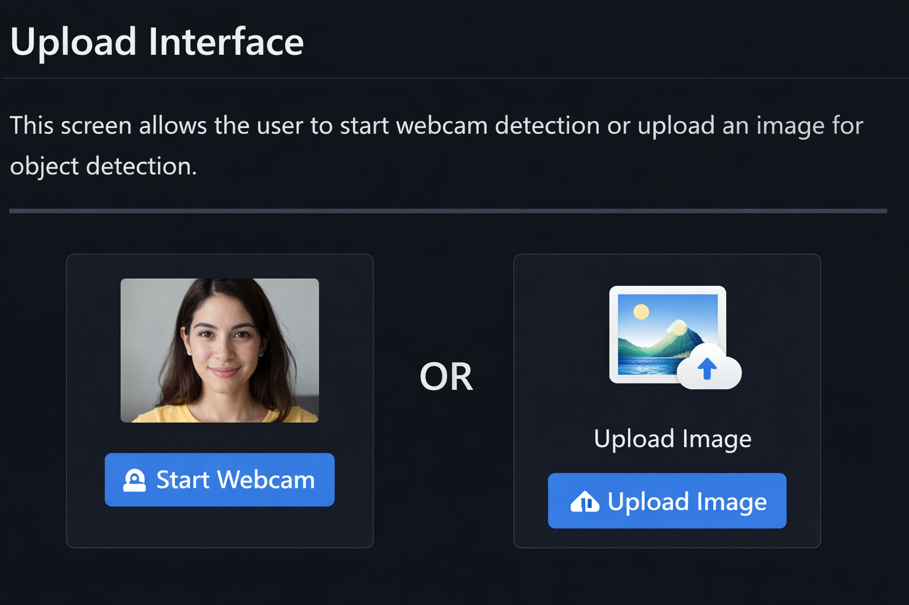
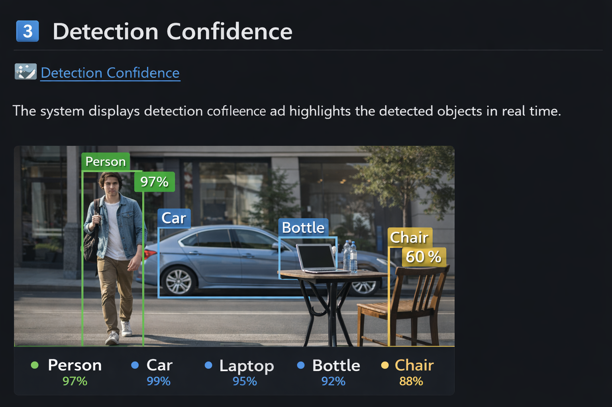

<p align="center">
  
</p>

# 🎯 Real-Time Object Detection System using YOLOv8

A **real-time object detection system** built using **YOLOv8 and OpenCV** that detects multiple objects in images, videos, and webcam streams.

The system uses a **pretrained deep learning model** to identify objects and display **bounding boxes with labels and confidence scores**.

---

# 🚀 Features

✔ Real-time object detection using webcam
✔ Object detection from images
✔ Object detection from video files
✔ Bounding box visualization
✔ Confidence score display
✔ FPS (Frames Per Second) counter

---

# 🛠 Tech Stack

* Python
* YOLOv8
* OpenCV
* NumPy
* Computer Vision

---

# 📂 Project Structure

```
object-detection-system
│
├── detect_webcam.py
├── detect_image.py
├── detect_video.py
├── requirements.txt
├── README.md
└── screenshots
    ├── upload.png
    ├── skills.png
    └── match.png
```

---

# ⚙ Installation

Clone the repository

```
git clone https://github.com/yourusername/object-detection-system.git
```

Navigate to the project folder

```
cd object-detection-system
```

Install dependencies

```
pip install -r requirements.txt
```

---

# ▶ Running the Project

### Run Webcam Detection

```
python detect_webcam.py
```

Press **Q** to exit the webcam window.

---

### Run Image Detection

```
python detect_image.py
```

---

### Run Video Detection

```
python detect_video.py
```

---

# 📸 Screenshots

## 1️⃣ Upload / Webcam Interface




This screen allows the user to start webcam detection or upload an image for object detection.

---

## 2️⃣ Objects Detected

The model detects objects in the frame and labels them with bounding boxes.

Example detected objects:

```
Person
Car
Laptop
Bottle
Chair
```

---

## 3️⃣ Detection Confidence



The system displays detection confidence and highlights the detected objects in real time.

---

# 💡 How It Works

1️⃣ The webcam or image is captured using **OpenCV**

2️⃣ The **YOLOv8 pretrained model** processes the frame

3️⃣ The model detects objects and returns:

* object class
* bounding box
* confidence score

4️⃣ Bounding boxes and labels are drawn on the frame.

---

# 📈 Example Output

Detected objects:

```
Person – 0.92
Laptop – 0.88
Bottle – 0.81
```

---

# 🎯 Future Improvements

* Web interface using Streamlit
* Object tracking system
* Custom model training
* Cloud deployment

---

# 👨‍💻 Author

Developed as a **Computer Vision project** using YOLOv8 and OpenCV for real-time object detection.

---
